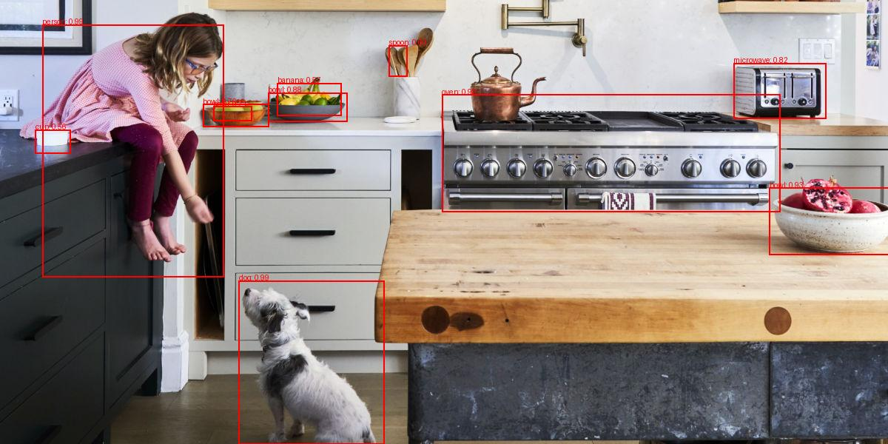

# Basics of neural networks

This repository contains a collection of projects exploring the fundamentals of neural networks.

## YOLOv3 Object Detection

This project demonstrates object detection using a pre-trained YOLOv3 model.

### Example

The following example shows the model detecting objects in a test image.

#### Original Image


#### Detected Image


=======
# Neural Network Basics

A collection of neural network implementations and experiments, from simple dense networks to advanced object detection models.

## What's in this repository

### Mac Camera Integration
**Location:** `mac-camera/`
- `camera.py` - Camera interface implementation for Mac
- `yolov8m.pt` - Pre-trained YOLOv8 medium model weights

### MNIST Implementations

#### Dense Network Only
**Location:** `mnist_onlydense/`
- Pure dense/fully-connected neural network implementation for MNIST digit classification
- No convolutional layers, just traditional dense layers
- Includes PDF documentation on neural network layer classes

#### PyTorch Implementation
**Location:** `mnist_pytorch/`
- Standard PyTorch implementation of MNIST classifier
- Saved models in both regular and traced formats
- Model loader utility for inference
- Downloaded MNIST dataset stored in `data/` directory

#### With Convolutional Layers
**Location:** `mnist_withconv/`
- Enhanced MNIST classifier using convolutional neural networks
- Better performance than dense-only implementation

### YOLOv3 Object Detection

#### Base Implementation
**Location:** `yolov3/`
- Inference-only detector using pre-trained YOLOv3
- Configuration file and pre-trained weights included
- Example test images and detection results

#### From Scratch Implementation
**Location:** `yolov3/yolov3_fromscratch/`
- Complete YOLOv3 implementation built from the ground up
- Training pipeline, loss functions, and utilities
- Modular design with separate files for model, dataset, and configuration

#### Custom Implementation
**Location:** `yolov3/yolov3_joflimplementation/`
- Personal implementation of YOLOv3 with custom modifications
- Bike detection dataset included with train/validation/test splits
- Training checkpoints saved at various epochs (0-90)
- Detection script for running inference on new images

## Quick Start

Each subdirectory contains its own `requirements.txt` for dependencies. Install them using:
```bash
pip install -r requirements.txt
```

Most implementations include a main Python file that can be run directly to see the model in action.
